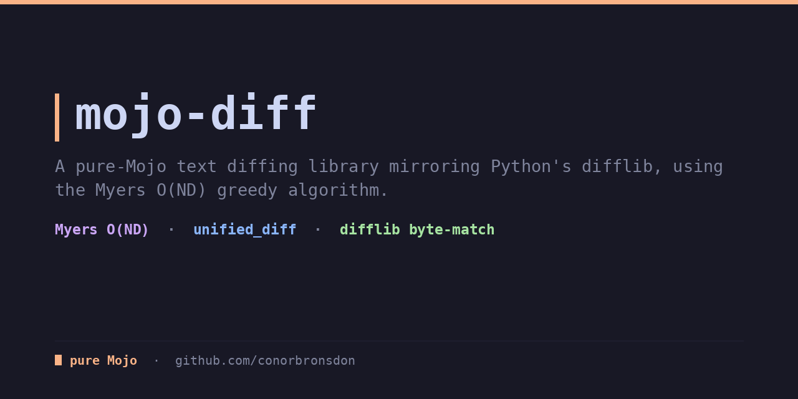
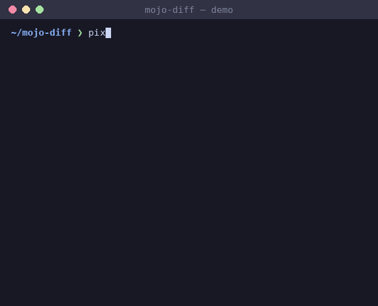

<div align="center">

# mojo-diff

**Text diffing in pure Mojo, mirroring Python's difflib. No Python dependencies, no FFI.**

[](LICENSE)
[](https://mojolang.org)
[](https://chainofthought.show)
[](https://x.com/ConorBronsdon)




</div>

As of mid-2026 the Mojo ecosystem has no line-diffing library. mojo-diff
fills that gap: a pure-Mojo implementation of the Myers O(ND) greedy diff
algorithm (Myers, 1986), exposed through the same opcode model and
unified-diff output that Python's
[`difflib`](https://docs.python.org/3/library/difflib.html) produces.
`unified_diff` is byte-for-byte compatible with `difflib.unified_diff` on
the fixture corpus in `test/data/`, generated directly by Python's
difflib.

## What it handles

- **`get_opcodes(a, b)`**, mirroring `SequenceMatcher.get_opcodes()`: edit
  opcodes turning `a` into `b`, tagged `"equal"` / `"replace"` /
  `"delete"` / `"insert"`, same 5-tuple shape as difflib.
- **`matching_blocks(a, b)`**, mirroring `get_matching_blocks()`:
  sentinel-terminated matching runs.
- **`ratio(a, b)`**, mirroring `SequenceMatcher.ratio()`: similarity as
  `2*M/T`.
- **`unified_diff(a_text, b_text, from_file, to_file, context=3)`**,
  mirroring `difflib.unified_diff`: standard unified-diff text, matching
  difflib's hunk grouping and `@@` range math exactly.
- **`splitlines_keepends(text)`**, mirroring `str.readlines()`: split on
  `\n`, keeping terminators.
- **Compatibility details**: lines keep trailing newlines like
  `readlines()`-fed difflib; a final line with no trailing newline is
  emitted without one and no GNU-diff `\ No newline at end of file`
  marker (difflib doesn't emit one either); identical inputs produce the
  empty string; empty ranges use difflib's `start-1,0` form and
  single-line ranges omit the length.

## What it deliberately does NOT do

- **Character-level or word-level diffing.** Line-level only, in v0.1.
- **Match difflib's Ratcliff-Obershelp alignment exactly on repeated
  lines.** Myers finds a minimal edit script; with heavily repeated
  lines that can differ from `SequenceMatcher`'s alignment, even though
  both are valid diffs.
- **`ndiff`, `context_diff`, `HtmlDiff`, `autojunk` heuristics.** Not
  implemented in v0.1.

## Install

With [pixi](https://pixi.prefix.dev):

```bash
pixi install
pixi run test
```

Or with uv:

```bash
uv venv
uv pip install mojo --index https://whl.modular.com/nightly/simple/ --prerelease allow
.venv/bin/mojo run -I src test/test_diff.mojo
```

Requires a Mojo nightly (`>=1.0.0b3`).

## Usage

```mojo
from diff import get_opcodes, unified_diff, ratio, matching_blocks, OpCode

def main() raises:
    var diff = unified_diff(
        open("a.txt", "r").read(), open("b.txt", "r").read(), "a.txt", "b.txt"
    )
    print(diff, end="")
```

```
--- a.txt
+++ b.txt
@@ -1,7 +1,9 @@
 def load(path):
+    if not path:
+        return 0
     data = open(path).read()
-    rows = data.split(chr(10))
+    lines = data.split(chr(10))
     total = 0
-    for r in rows:
-        total += len(r)
+    for line in lines:
+        total += len(line)
     return total
```

`OpCode` is `{tag, a_start, a_end, b_start, b_end}`, the same shape as
difflib's opcodes.

## Tests

```bash
pixi run test
```

32 tests cover opcode generation, matching blocks, ratio calculation, and
`splitlines_keepends`, plus 11/11 unified-diff fixtures matching
Python's difflib byte-for-byte (identical inputs, single-line files,
multi-hunk diffs at multiple context widths, content-to-empty and
empty-to-content, and missing-trailing-newline cases). A performance test
diffs 5,000 lines in roughly 0.9ms. Fixtures and their expected outputs
are (re)generated with `python3 test/data/generate_fixtures.py`.

`test/fuzz_runner.mojo` exercises the diff engine against corrupted or
random input to confirm it never crashes.

## Part of the Mojo content-tooling suite

- [mojo-feed](https://github.com/conorbronsdon/mojo-feed): RSS, Atom, and
  JSON Feed parsing.
- [mojo-captions](https://github.com/conorbronsdon/mojo-captions): SRT and
  WebVTT subtitle/transcript parsing.
- [mojo-html](https://github.com/conorbronsdon/mojo-html): HTML parsing.
- [mojo-markdown](https://github.com/conorbronsdon/mojo-markdown): Markdown
  parsing.
- [mojo-tar](https://github.com/conorbronsdon/mojo-tar): tar archive
  reading and writing, mirroring `tarfile`.
- [mojo-unicodedata](https://github.com/conorbronsdon/mojo-unicodedata):
  Unicode normalization and case folding.
- [mojo-redis](https://github.com/conorbronsdon/mojo-redis): a Redis
  client, mirroring `redis-py`.
- [mojo-template](https://github.com/conorbronsdon/mojo-template): a
  Jinja-flavored template engine.

## Contributing

Issues and PRs welcome, especially cases where output diverges from
Python's difflib (attach the two inputs) and repeated-line scenarios
where Myers and Ratcliff-Obershelp disagree. Run `pixi run test` before
sending a PR, and regenerate fixtures with
`python3 test/data/generate_fixtures.py` if you add test data.

## About

Built by [Conor Bronsdon](https://conorbronsdon.com) — host of
[Chain of Thought](https://chainofthought.show), a podcast about AI agents,
infrastructure, and engineering. Find me on [X](https://x.com/ConorBronsdon)
or [LinkedIn](https://www.linkedin.com/in/conorbronsdon).

---

## Disclaimer

*All views, opinions, and statements expressed on this account/in this repo are solely my own and are made in my personal capacity. They do not reflect, and should not be construed as reflecting, the views, positions, or policies of Modular. This account is not affiliated with, authorized by, or endorsed by my employer in any way.*

## License

Licensed under the [MIT License](LICENSE).
